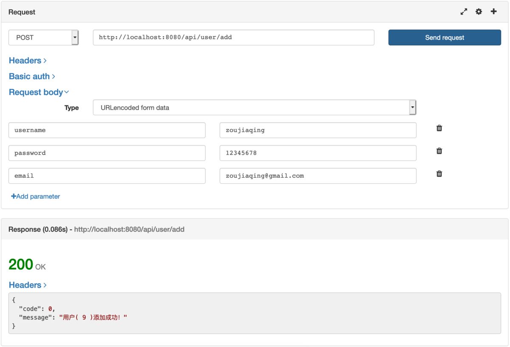
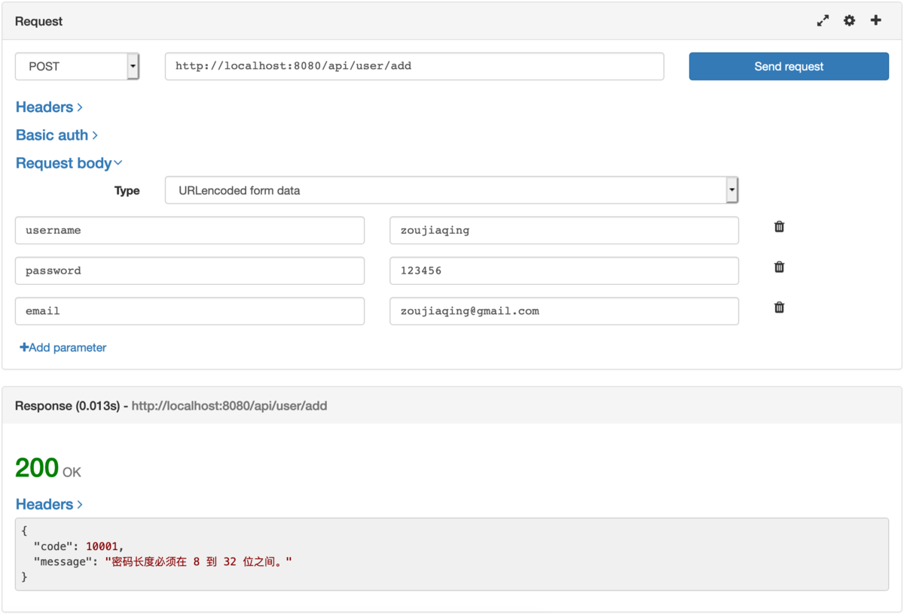

# Quick create serverside project using D Programming Language

`Hunt framework` is a full stack web framework developed in D language, similar to larravel / springboot / Django, etc., which allows D language developers to quickly create projects. It has built-in multi business specifications. One is to facilitate developers to use it out of the box; the other is to facilitate managers to review the project code more easily.

This sample code is based on the latest `Hunt framework` version `3.2.0`. Let`s feel the pleasure of using dlang to develop:)

## 1. Create a common template page rendering project

### 1.1 create an empty project based on skeleton project

First, use the `git` command to clone the skeleton project locally.

```bash
git clone https://github.com/huntlabs/hunt-skeleton.git myproject
cd myproject
```

### 1.2 modify the project HTTP listening address and port
HTTP related configuration items are in `config/application.conf` The following information can be found in the following: the IP address we are listening to is `127.0.0.1` and the port is `8080`:

```conf
http.address  = 127.0.0.1
http.port  = 8080
```

### 1.3 controller

We can see the source code of `source/app/controller/IndexController.d`. This is a common controller. The code is as follows:

```D
module app.controller.IndexController;
import hunt.framework;
class IndexController : Controller
{
    mixin MakeController;

    @Action
    string index()
    {
        return view.render("index");
    }
}
```

We can see that the `IndexController` controller also has a `index` action. This method is marked as an accessible page with @Action, and the page is rendered using the view view view `index.html` Template (the extension of the template is omitted due to security issues).
The view here will render `resources/views/default/index.html` Template file.

### 1.4 routing configuration

The default routing configuration table `config/routes` can be found in the configuration file directory. There is a record in the skeleton project as follows:

```conf
GET    /     index.index
```

This semantics is to use the `GET` method to access `/` this path will be mapped to the `index` function of the `IndexController` controller.

###1.5 compile and run the project
The whole project is managed by the `dub` package manager, which can be compiled and run in one command

```sh
dub run -v
```

At this time, you can access according to your own IP and port configuration

```text
http://127.0.0.1 :8080
```

So far, your D language project is running, isn`t it cool? 😎 That next chapter to point database operation.

## 2 create an API project to add, delete, modify and query

Before creating the add, delete, modify and query API, we need to do some preparatory work. First, create the table structure of the database, and second, enable the routing group support of the framework so that users can access the `example.com/api/` Or `api.example.com` Can be accessed in the form of.

### 2.1 first, let`s turn on the routing group

In `config/application.conf` Configuration item found `route.groups` It is amended as follows:

```conf
route.groups  = api:path:api
```

Let me explain it here `api:path:api` meaning, {key of routing group}:{method of accessing routing group}:{custom value of routing group}. After setting above, our API access address prefix should be:

```text
http://127.0.0.1:8080/api/
```

If we set it to `route.groups  = api:domain:api.example.com` The prefix for accessing API address is:

```text
http://api.example.com/
```

### 2.2 our table structure design

You can execute this SQL to create a table by yourself. Our database uses the example of MySQL 5.7.x :

```SQL
SET NAMES utf8mb4;
SET FOREIGN_ KEY_ CHECKS = 0;

-- ----------------------------
-- Table structure for my_ user
-- ----------------------------
DROP TABLE IF EXISTS `my_ users`;

CREATE TABLE `my_ users` (
    `id` bigint(20) NOT NULL AUTO_ INCREMENT,
    `username` varchar(255) DEFAULT NULL,
    `password` varchar(255) DEFAULT NULL,
    `email` varchar(255) DEFAULT NULL,
    `created` bigint(11) DEFAULT NULL,
    `updated` bigint(11) DEFAULT NULL,
    PRIMARY KEY (`id`)
) ENGINE=InnoDB DEFAULT CHARSET=utf8mb4;

SET FOREIGN_ KEY_ CHECKS = 1;
```

### 2.3 modify database related configuration files
Database configuration item file in `config/ application.conf `Modify to find the following configuration and set it according to your local database environment:

```conf
# Database
database.driver  = mysql
database.host  = 127.0.0.1
database.port  = 3306
database.database  = myproject
database.username  = root
database.password  = 123456
database.charset  = utf8mb4
database.prefix  = my_
database.enabled  = true
```

### 2.4 create database model

We create the model class:
`app/model/user.d`

```D
module app.model.User;

import hunt.framework;

@Table("users")
class User : Model
{
    mixin MakeModel;

    @AutoIncrement
    @PrimaryKey
    ulong id;

    string username;

    string password;

    string email;

    uint created;

    uint updated;
}
```

### 2.5 creating repository objects

This object only needs to inherit `EntityRepository`. It already contains a lot of rich operation methods:

`app/repository/UserRepository.d`

```D
module app.repository.UserRepository;

import hunt.framework;

import app.model.User;

class UserRepostiroy : EntityRepository!(User, ulong)
{

}
```

Here, the inherited `EntityRepository` of our custom `UserRepository` is the class of `Hunt entity`. We pass the user-defined model class` user `and primary key type` ulong `by template value passing. This compilation will help us deal with a lot of things. We just need to remember how to write them.

### 2.6 create a class for form validation

As an API, it is difficult to receive and verify post forms. The `Hunt framework` has a built-in form verification mechanism. We need to implement a form verification object `app/form/Userform.d`:

```D
module app.form.UserForm;

import hunt.framework;

class UserForm : Form
{
    mixin MakeForm;

    @Length (4, 30, "user name length must be between {min} and {Max}} bits.")
    string username;

    @Length (8, 32, "password length must be between {min} and {Max} bits.")
    string password;

    @Notempty ("email address cannot be empty.")
    string email;
}

```

### 2.7 create the controller corresponding to API

Because our API uses an independent routing group, we need to create a subdirectory `api` under the `app/controller/` directory to save the corresponding controller class files. Therefore, our class file is named `app/controller/api/UserController.d`:

```D
module app.controller.api.UserController;

import hunt.framework;

import app.repository.UserRepostiroy;
import app.model.User;
import app.message.ResultMessage;
import app.form.UserForm;

class UserController : Controller
{
    mixin MakeController;

    @Action
    Response add(UserForm form)
    {
        // Resultmessage is the body of the JSON message to be returned
        auto resultMessage = new ResultMessage;

        // Use the valid () method to get a verification result object
        auto valid = form.valid ();

        if (! valid.isValid ())
        {
            //Give me an error code
            resultMessage.code = 10001;

            // The valid.messages() method can get all the error information. Here we simply get one error and return it
            foreach (message; valid.messages())
            {
                resultMessage.message = message;
                break;
            }
        }
        else
        {
            auto repository = new UserRepository;

            auto user = new User;
            user.username = form.username;
            user.password = form.password;
            user.email = form.email;

            // Save model data to database
            repository.save (user);

            // Because there is no error, you don`t need to set the error code. You can prompt the successful addition

            import std.format : format;
            resultMessage.message =Format! "User (% d) added successfully! "( user.id );
        }

        // The returned result object is automatically serialized by JsonResponse to JSON and returned to the client
        return new JsonResponse(resultMessage);
    }
}

```

Here is the code for Reusltmessage:

`app/message/ReusultMessage.d`

```D
module app.message.ResultMessage;

class ResultMessage
{
    uint code = 0;

    string message;
}
```

### 2.8 API routing profile

Each routing group has its own routing configuration table, and the routing configuration table of `api` is `config/api.routes`. Is this rule very simple? Let`s look at the routing configuration item for adding user interface:

```conf
POST /user/add user.add
```

Is it easy? Here because it is `config/api.routes` Therefore, the controller will find the corresponding `UserController` controller and `add` function in the `app/controller/api/` directory.

### 2.9 test add user interface

Here, we use the Firefox plug-in to make interface requests. We add three fields according to the requirements of the form, which are `username`, `password`, `email`. We also fill in according to the verification rules in `UserForm`. When we submit the form, we can see the following interface:



Here prompt `user (9) added successfully!` The number '9' here is actually the primary key ID returned after we write the user data into the database.

In order to test the effect of form verification, we changed the password from 8 bits to 6 bits, because we set the rule in `UserForm` between 8 and 32 bits. We submitted the form again as follows:

)

This shows that our form validation has worked:)

## 3 Summary

The total completed project directory structure is as follows:

```text
MYRPOJECT/
├── config
│   ├──  api.routes
│   ├──  application.conf
│   └── routes
├── data
│   └──  mysql.sql
├──  dub.sdl
├── resources
│   ├── translations
│   │   ├── en-us
│   │   │   └──  message.ini
│   │   └── zh-cn
│   │       └──  message.ini
│   └── views
│       └── default
│           ├──  footer.html
│           ├──  header.html
│           └──  index.html
├── source
│   ├── app
│   │   ├── controller
│   │   │   ├── IndexController.d
│   │   │   └── api
│   │   │       └── UserController.d
│   │   ├── form
│   │   │   └── UserForm.d
│   │   ├── message
│   │   │   └── ResultMessage.d
│   │   ├── model
│   │   │   └── User.d
│   │   └── repository
│   │       └── UserRepository.d
│   └── main.d
└── wwwroot
└──  favicon.ico
```

The whole project is also clear and clear. It has a familiar flavor in the use of the framework. The hunt framework has the development efficiency as fast as that of `larevel`, the standard database operation mode like `springboot`, and the convenient deployment mode after the compilation of native language like `golang`.

## Related resource address

* Huntlabs official website: https://www.huntlabs.net
* Hunt framework code base: https://github.com/huntlabs/hunt-framework
* Hunt framework documentations: https://github.com/huntlabs/hunt-framework-documentation
* Complete sample code: https://github.com/zoujiaqing/example-myuser
