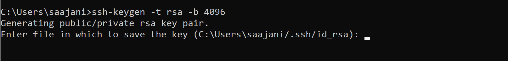

# Visual Studio Code里的D语言开发环境配置

## 安装D语言编译器

D语言有3种个编译器版本：dmd、ldc和gdc。一般情况下，建议可以多使用ldc。

### Linux系统下的安装

访问D语言[官方网站](https://dlang.org/download.html)，下载最新安装包保存到本地，然后安装。

```sh
sudo dpkg -i dmd_2.094.2-0_amd64.deb
```

### Windows系统下的安装

参考：https://forums.dlangchina.com/thread/10029


## VS Code的安装

访问[官网](https://code.visualstudio.com/)下载指定平台的最新版本，然后安装。

## 主要插件安装

### D语言插件

如图在插件商店搜索`dlang`：


在`Linux`平台，优先选择安装`code-d`。其他平台，则建议安装`Dlang 1.16.8`。后者稳定性要优于前者，前者功能比后者强大。

在正常情况，安装以后已能支持代码提示和跳转等常用功能。


### C/C++语言插件

在插件搜索输入框输入“C++”，搜索插件“C/C++ for Visual Studio Code”。点击`install`安装插件。如下图：


**注意：** 安装此插件仅提供调试用的相关工具，如果需要C++的开发，则还需要做一些额外的设置。


### 断点调试

1. 允许断点设置

在设置页面里搜索`everywhere`，并启用`任意断点`模式。


点击左下角的管理按钮，选择“设置”，在设置页面输入框中输入“every”，在出现的结果集中的 “Debug: Allow Breakpoints Everywhere”选项下勾选“允许在任何文件中设置断点”。

2. 创建`launch.json`文件

在左边工具栏里点击`运行`图标。如果工程里还则创建过`launch.json`文件，则根据提示点击`create a launch.json`链接。然后根据平台，选择C++相关的调试器，进入相关设置。如下图所示：


3. 设置待调试的启动程序

在`launch.json`文件里，修改`program`参数，如`${workspaceFolder}/demo`，其中：

`${workspaceFolder}`是工作区，`demo`是待调试的项目执行文件。


4. 开始调试

打开源文件，设置断点。然后，在左边工具栏里点击`运行`图标，点击左上角的`(gdb) launch`前面的`Start Debugging`按钮(如下图所示)。


### 远程开发

#### 插件安装
在插件商店里搜索`Remote`，并安装`Remote Development`插件。


#### 免密SSH登录配置

1. 创建SSH密钥

如果没有SSH密钥对，请打开bash shell或命令行并键入：

```sh
ssh-keygen -t rsa -b 4096
```

这将生成SSH密钥。在以下提示符下按`Enter`键，将密钥保存在默认位置（在用户主目录下，名为的文件夹`.ssh`）。



然后将提示您输入安全密码，但是您可以将该空格保留为空白。现在，您应该有一个id_rsa.pub包含新的公共SSH密钥的文件

2. 将SSH密钥添加到服务器

将公钥`id_rsa.pub`的内容放到服务器上的`authorized_keys`文件里(通常位于`/root/.ssh/authorized_keys`)。


### Bookmarks插件

它可以帮助您在代码中导航，轻松快速地在重要位置之间移动。无需搜索代码。它还支持一组选择命令，允许您在书签行之间选择书签行和区域。

  
常用命令:
- Bookmarks: Toggle 使用书签标记/取消标记位置
- Bookmarks: Toggle Labeled 标记标记的书签
- Bookmarks: Jump to Next 将光标向前移动，移到下面的书签
- Bookmarks: Jump to Previous 向后移动光标，移到上面的书签
- Bookmarks: List列 出当前文件中的所有书签
- Bookmarks: List from All Files 列出所有文件的所有书签
- Bookmarks: Clear 删除当前文件中的所有书签
- Bookmarks: Clear from All Files 从所有文件中删除所有书签
- Bookmarks (Selection): Select Lines 选择包含书签的所有行
- Bookmarks (Selection): Expand Selection to Next 将所选文本展开到下一个书签
- Bookmarks (Selection): Expand Selection to Previous 将所选文本扩展到上一个书签
- Bookmarks (Selection): Shrink Selection 将选择文本缩小到"上一个/下一个"书签
  

### Comment It
这是一个与注释操作相关的插件。


目前主要支持功能有：
- 自动注释
- TODO注释
- 分隔条注释
- 文件头注释


### Todo Tree


写代码过程中，突然发现一个 Bug，但是又不想停下来手中的活，以免打断思路，怎么办？按照代码规范，我们一般是在代码中加个 TODO 注释。比如：

```bash
//TODO:这里有个bug，我一会儿再收拾你
```

或者：

```bash
//FIXME:我也不知道为啥， but it works only that way.
```


### Markdown Preview Github Styling

以 GitHub 风格预览 Markdown 样式，十分简洁优雅。就像下面这样，左侧书写 Markdown 文本，右侧预览 Markdown 的渲染效果，效果如下图：


### compareit

VS Code 默认支持对比两个文件的内容。选中两个文件，然后右键选择「将已选项进行比较」即可，效果如下：


VS Code 自带的对比功能并不够强大，我们可以安装插件compareit，进行更丰富的对比。比如说，安装完插件compareit之后，我们可以将「当前文件」与「剪切板」里的内容进行对比：


 

### HTML CSS Support

增强对HTML等格式文件的编辑功能。


## 主要操作

### 子窗体分隔


### 列选择


